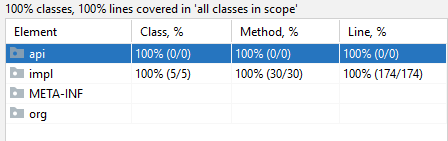

# Car taylor

Project for software analysis and design course.  
Implement a car configuration API.  
Document and cover as much code as possible with tests (100% if possible).  

More information in **ACO_project.pdf** and in **javadoc/**.

Project for University.

## Preview

**Test coverage**  
